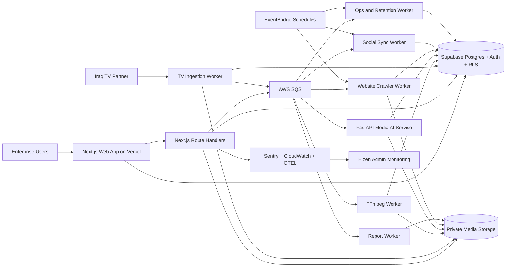

# FizZion System Architecture

## Goals

FizZion is designed as a production SaaS control plane for cross-media advertising monitoring in Iraq, spanning:

- Linear TV
- Social platforms
- Websites and display ads
- Out-of-home inventory

The architecture separates user-facing SaaS workflows from long-running media and crawler jobs.

## Top-level architecture

## Deployment model

### Frontend and app APIs

- Next.js App Router deployed on Vercel
- Edge-safe middleware for locale, auth gate routing, and security headers
- Route handlers for application-facing APIs, signed URL handoff, and orchestration
- Server Components for reporting surfaces and fast initial loads

### Primary data plane

- Supabase PostgreSQL for normalized application data
- Supabase Auth for user identity and MFA
- Supabase RLS for org-scoped data access
- Supabase Realtime for notifications, review-queue updates, and health changes

### Media plane

- S3 or Cloudflare R2 private buckets
- Raw recordings, derived clips, screenshots, thumbnails, and report exports stay outside Postgres
- Signed access URLs generated server-side only

### Processing plane

- ECS Fargate services for long-running jobs
- Queue-per-domain pattern using SQS and dead-letter queues
- Idempotent job handlers with retry metadata persisted in Postgres
- FastAPI service for OCR, speech, embeddings, logo detection, and multimodal classification

## Service boundaries

### Web app

Responsibilities:

- Authenticated user workflows
- Dashboards, search, review queues, reports, filters
- Admin configuration
- Signed media access orchestration
- External connector configuration UI

Must not perform:

- Long-running video processing
- High-volume crawling
- Persistent stream recording

### Media AI service

Responsibilities:

- OCR abstraction for Arabic and English
- Speech-to-text abstraction
- Visual embedding generation
- Logo and brand classification pipeline
- Confidence scoring

### Workers

- `tv-ingestion-worker`: validates uploads, ffprobe, dedupe, proxy creation triggers
- `tv-detection-worker`: ad break segmentation, fingerprint matching, occurrence creation
- `web-crawler-worker`: Playwright capture, ad extraction, screenshot persistence
- `social-sync-worker`: OAuth and public monitoring sync jobs
- `report-worker`: background report materialization and export packaging
- `ops-worker`: retention, cleanup, queue recovery, health rollups

## Data flow by module

### TV intelligence

1. Iraq-side partner uploads hourly or half-hourly segments using pre-signed multipart or SFTP.
2. Intake validates checksum, channel, timestamp, and codec metadata.
3. Raw file metadata is written to `tv_recording_files`.
4. Proxy and thumbnails are derived and stored in private storage.
5. Detection jobs segment ad breaks and ad occurrences.
6. Each airing creates its own occurrence record and 5s-pre/5s-post derivative clip.
7. Unknowns enter the review queue.

### Social intelligence

1. User adds account by URL or handle.
2. Platform resolver normalizes and classifies connection type.
3. OAuth flow or public-monitoring workflow is created.
4. Sync worker retrieves raw provider payloads and writes normalized metrics.
5. Availability matrix controls which metrics render and which show as unavailable.

### Website intelligence

1. Schedules trigger Iraq-geolocated Playwright sessions.
2. Browser profile, device, language, consent state, and run metadata are logged.
3. Candidate ad units are identified through DOM, requests, OCR, and image heuristics.
4. Screenshot context and creative artifacts are persisted.
5. Occurrences are deduplicated into creative identities without deleting repeated captures.

### OOH intelligence

1. Authorized users manage locations and campaign assignments.
2. Photos and verification visits upload to private storage.
3. Map and list views query normalized location and assignment data.

## Security architecture

- Supabase RLS is the primary tenant boundary
- Service role keys remain server-only
- All secrets stored in Vercel env vars, AWS Secrets Manager, or Supabase secrets
- File uploads validated by MIME, extension, and checksum
- Signed URL generation performed in server handlers only
- Audit log writes are append-only
- CSP, HSTS, CSRF, rate limits, and admin confirmation flows enforced in app layer

## Observability

- Sentry in frontend, route handlers, workers, and FastAPI
- Structured JSON logs in workers
- Queue depth, source uptime, and failure metrics surfaced to Data Quality
- Processing version and model version captured on derived records

## Key external dependencies

See [external-dependencies.md](/d:/Fizzion/docs/external-dependencies.md).

