# FizZion ERD

## Domain model summary

The schema is normalized around organizations, master brand entities, creative identities, source-specific occurrences, and operational provenance.

```mermaid
erDiagram
  organizations ||--o{ organization_members : has
  organizations ||--o{ profiles : owns
  organizations ||--o{ saved_views : owns
  organizations ||--o{ notifications : owns
  organizations ||--o{ brands : owns
  organizations ||--o{ campaigns : owns
  organizations ||--o{ creative_assets : owns
  organizations ||--o{ tv_channels : owns
  organizations ||--o{ social_accounts : owns
  organizations ||--o{ websites : owns
  organizations ||--o{ ooh_locations : owns
  organizations ||--o{ reports : owns
  organizations ||--o{ alert_rules : owns

  roles ||--o{ organization_members : grants
  roles ||--o{ role_permissions : maps
  permissions ||--o{ role_permissions : maps

  brands ||--o{ brand_aliases : has
  brands ||--o{ products : has
  brands ||--o{ campaign_brands : participates
  campaigns ||--o{ campaign_brands : includes
  campaigns ||--o{ creative_assets : groups

  creative_assets ||--o{ creative_variants : has
  creative_assets ||--o{ creative_embeddings : indexed_by
  creative_assets ||--o{ creative_tags : tagged_with

  tv_source_partners ||--o{ tv_sources : provides
  tv_channels ||--o{ tv_sources : receives
  tv_channels ||--o{ tv_recording_files : records
  tv_recording_files ||--o{ tv_processing_jobs : spawns
  tv_recording_files ||--o{ tv_ad_breaks : contains
  tv_ad_breaks ||--o{ tv_ad_occurrences : contains
  tv_ad_occurrences }o--|| creative_variants : matches
  tv_ad_occurrences ||--o{ tv_ad_occurrence_clips : exports
  tv_ad_occurrences ||--o{ tv_detection_evidence : supported_by
  tv_ad_occurrences ||--o{ tv_review_actions : reviewed_by

  social_platforms ||--o{ social_accounts : hosts
  social_accounts ||--o{ social_connections : connected_as
  social_connections ||--o{ social_oauth_tokens : authorizes
  social_accounts ||--o{ social_account_snapshots : snapshots
  social_accounts ||--o{ social_posts : publishes
  social_posts ||--o{ social_post_media : contains
  social_posts ||--o{ social_post_metrics : measured_by
  social_accounts ||--o{ social_account_metrics : measured_by
  social_accounts ||--o{ social_sync_jobs : syncs
  social_sync_jobs ||--o{ social_raw_payloads : captures

  websites ||--o{ website_crawl_configs : configured_by
  websites ||--o{ website_pages : includes
  websites ||--o{ website_crawl_runs : crawled_by
  website_crawl_runs ||--o{ website_crawl_errors : fails_with
  website_crawl_runs ||--o{ website_ad_occurrences : detects
  website_ad_occurrences }o--|| website_ad_creatives : dedupes_to
  website_ad_occurrences ||--o{ website_ad_screenshots : stores
  website_browser_profiles ||--o{ website_crawl_runs : powers

  ooh_vendors ||--o{ ooh_media_units : supplies
  ooh_locations ||--o{ ooh_media_units : contains
  ooh_media_units ||--o{ ooh_campaign_assignments : booked_as
  ooh_campaign_assignments ||--o{ ooh_photos : evidenced_by
  ooh_campaign_assignments ||--o{ ooh_verification_visits : verified_by
  ooh_campaign_assignments }o--|| ooh_creatives : displays

  reports ||--o{ report_runs : generates
  report_runs ||--o{ exports : delivers
  alert_rules ||--o{ alerts : triggers
  organizations ||--o{ integration_health : monitors
  organizations ||--o{ data_retention_policies : configures
  organizations ||--o{ processing_jobs : tracks
  organizations ||--o{ audit_logs : records
```

## Key modeling decisions

- Creative identity is shared cross-media using `creative_assets` and `creative_variants`.
- Source-specific occurrence tables preserve auditability and playback context.
- Raw provider payloads are stored separately from normalized metrics.
- Operational and AI provenance are first-class fields, not afterthought metadata.

