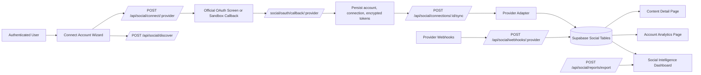

# Social Intelligence Module

## Overview

The Social Intelligence module extends FizZion with provider-based account connection, synchronization, reporting, and content analytics for:

- Facebook Pages
- Instagram Professional Accounts
- TikTok Accounts
- YouTube Channels

The current implementation supports:

- platform selection and URL/handle discovery
- signed OAuth state persistence
- official OAuth launch URLs when provider credentials are configured
- clearly labeled sandbox connection mode when credentials are missing
- secure encrypted token persistence
- connection inventory dashboard
- account analytics detail pages
- content detail pages with imported comments and machine-generated sentiment labels
- CSV export for portfolio and account-level reports
- webhook event persistence with idempotency keys

## Mermaid Architecture



## Database Summary

The module builds on the existing social tables and adds/extends:

- `social_connections`
  - token/sync status, external account id, profile metadata, next sync scheduling
- `social_oauth_tokens`
  - token type, provider user id, encryption version, revocation tracking
- `social_account_snapshots`
  - normalized periodic follower/reach/engagement snapshots
- `social_posts`
  - titles, descriptions, collaborators, tags, raw payload storage
- `social_post_metrics`
  - views, watch time, completion, normalized metric JSON
- `social_account_metrics`
  - profile visits, website clicks, unique viewers, normalized metric JSON
- `social_comments`
  - comment text, engagement, sentiment, spam-like flag
- `social_sync_jobs`
  - provider, job type, records processed, error metadata
- `social_webhook_events`
  - idempotent webhook receipt storage
- `social_oauth_states`
  - signed OAuth state persistence and one-time-use tracking

## API Surface

- `POST /api/social/discover`
- `GET /api/social/connections`
- `POST /api/social/connect/:provider`
- `GET /api/social/oauth/:provider/callback`
- `GET /api/social/connections/:id`
- `DELETE /api/social/connections/:id`
- `POST /api/social/connections/:id/sync`
- `POST /api/social/connections/:id/reconnect`
- `GET /api/social/connections/:id/metrics`
- `GET /api/social/connections/:id/content`
- `GET /api/social/content/:contentId`
- `GET /api/social/content/:contentId/metrics`
- `GET /api/social/content/:contentId/comments`
- `GET /api/social/reports/portfolio`
- `GET /api/social/reports/account/:id`
- `POST /api/social/reports/export`
- `GET /api/social/webhooks/:provider`
- `POST /api/social/webhooks/:provider`

## Provider Scope Checklist

### Meta: Facebook Pages

- `pages_show_list`
- `pages_read_engagement`
- `pages_read_user_content`
- `business_management`

### Meta: Instagram Professional Accounts

- `instagram_basic`
- `instagram_manage_insights`
- `pages_show_list`
- `pages_read_engagement`

### TikTok

- `user.info.basic`
- `video.list`

### YouTube

- `youtube.readonly`
- `yt-analytics.readonly`

## Environment Setup

Add these variables in `.env.local` and production secrets:

```env
APP_BASE_URL=
TOKEN_ENCRYPTION_KEY=
SOCIAL_WEBHOOK_VERIFY_TOKEN=

META_APP_ID=
META_APP_SECRET=
META_REDIRECT_URI=
META_WEBHOOK_VERIFY_TOKEN=

TIKTOK_CLIENT_ID=
TIKTOK_CLIENT_KEY=
TIKTOK_CLIENT_SECRET=
TIKTOK_REDIRECT_URI=

GOOGLE_CLIENT_ID=
GOOGLE_CLIENT_SECRET=
GOOGLE_REDIRECT_URI=
YOUTUBE_CLIENT_ID=
YOUTUBE_CLIENT_SECRET=

REDIS_URL=
```

## Local Testing Workflow

1. Run the latest social migration in Supabase.
2. Ensure the base seed file has created `social_platforms`.
3. Start the web app with `npm run dev --workspace web`.
4. Open `/social/accounts`.
5. Use the connect wizard.
6. In environments without provider credentials, continue through sandbox mode.
7. Confirm that:
   - the account appears in the dashboard
   - the account detail page loads
   - content detail pages show metrics and comments
   - CSV export downloads successfully

## Known Limitations

- Live provider token exchange and metric import still require real production app credentials and provider app-review approval.
- CSV export is implemented; PDF export still needs a dedicated rendering pipeline.
- Webhook signature verification is scaffolded through verify tokens and idempotent storage, but each provider’s production signing scheme still needs its final secret configuration.
